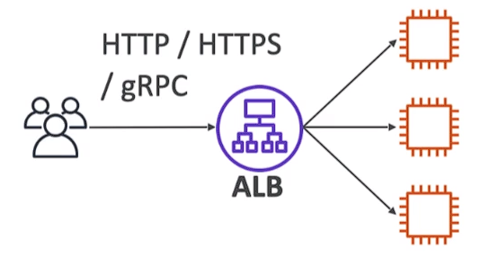
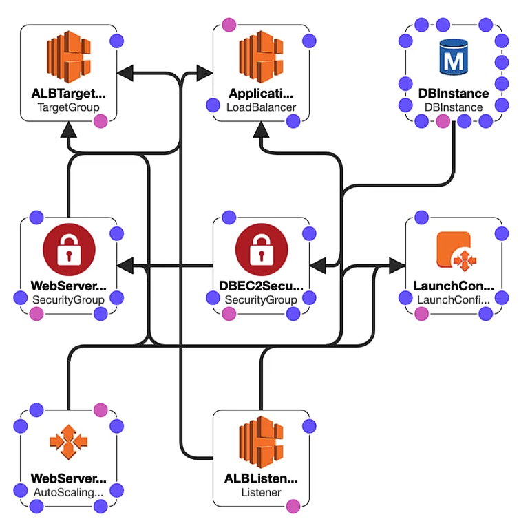

# AWS Certified Cloud Practitioner

## ¿Qué es Cloud Computing?

### ¿De qué se compone un servidor?

- Computación: CPU
- Memoria: RAM
- Almacenamiento: Información
- Base de datos: Almacenar los datos de forma estructurada
- Red: Permite la comunicación entre un emisor y un destinatario entre sí.
  - Router: Dispositivo de red que reenvía paquetes de datos entre redes de ordenadores.
  - Switch: Toma un paquete y lo envía al servidor/cliente correcto en tu red.

### Infraestructura tradicional

Inicialmente los servidores se almacenaban de forma local, comenzando por una casa, luego una oficina y finalmente un centro de datos. Los problemas con esto son:

- Pagar alquiler del centro de datos.
- Pagar el suministro eléctrico, refrigeración y mantenimiento.
- Añadir y sustituir el hardware lleva tiempo.
- El escalado es liminado

### Cloud Computing

Es el suministro bajo demanda de potencia de cálculo, almacenamiento en bases de datos, aplicaciones y otros recursos informáticos. A través de una plataforma de servicios en el cloud con precios de pago por uso. Permite aprovisionar exactamente el tipo y tamaño de los recursos informáticos que se necesitan, accediendo a ellos de forma casi inmediata. Entrega una forma sencilla de acceder a servidores, almacenamiento, bases de datos y un conjunto de servicios de aplicaciones.

**Características:**

- Autoservicio bajo demanda (on-demand): Los usuarios pueden aprovisionar recursos y utilizarlos sin interacción humanda del proveedor de servicios.
- Amplio acceso a la red: Los recursos están disponibles a través de la red, y pueden ser accedidos por diversas plataformas de clientes.
- Alquiler múltiple y agrupación de recursos: Varios clientes pueden compartir la misma infraestructura y aplicaciones con seguridad y privacidad.
- Rápida elasticidad y escalabilidad: Adquirir y disponer de recursos de forma automática y rápida cuando sea necesario. Escala rápida y fácilmente en función de la demanda.
- Servicio medido: El uso se mide, los usuarois pagan correctamente por lo que han utilizado.

**Ventajas:**

- Cambia el gasto de capital por el gasto operativo.
- Te beneficias de economías de escala masivas.
- Deja de adivinar la capacidad: Escala basada en el uso real medido.
- Aumentar la velocidad y agilidad.
- Dejar de gastar dinero en el funcionamiento y mantenimineto de los centros de datos.
- Se global en minutos: Se aprovecha la infraestructura global de AWS.

**Problemas resueltos:**

- Flexibilidad
- Rentabilidad
- Escalabildidad
- Elasticidad
- Alta disponibilidad y tolerancia a los fallos
- Agilidad

### Tipos de Cloud Computing

**Infraestructura como servicio (IaaS):**

- Proporciona bloques de construcción para la IT en el cloud.
- Proporciona redes, ordenadores y espacio de almacenamiento de datos.
- Máximo nivel de flexibilidad.
- Fácil paralelismo con la IT tradicional en las instalaciones.

**Plataforma como servicio (PaaS):**

- Elimina la necesidad de que la organización gestiona la infraestructura adyacente.
- Se centra en el despliegue y gestión de las aplicaciones.

**Software como servicio (SaaS):**

- Producto completo que es ejecutado y gestionado por el proveedor de servicios.

**Tabla comparativa:**


**Ejemplos en AWS:**

- IaaS: Amazon EC2
- PaaS: Elastic Beanstalk
- SaaS: Rekognition para el _Machine Learning_

#### Precios del Cloud

AWS tiene 3 gundamentos de precios, siguiendo el modelo de precios de pago por uso:

- Computación: Pagar por el tiempo de computación.
- Almacenamiento: Pagar por los datos almacenados.
- Transferencia de datos fuera del Cloud: La transferencia de datos hacia adentro es gratuita.

#### Historia del Cloud AWS

- 2002: Lanzamiento interno.
- 2003: La infraestructura de Amazon es uno de sus puntos fuertes (Idea de mercado).
- 2004: Lanzamiento público con SQS.
  2006: Relanzamiento público con SQS, S3 y EC2.
  2007: Lanzamiento en Europa.

#### [Infraestructura global de AWS](https://infrastructure.aws)

1. **Regiones de AWS - AWS Regions**

   Cada región tiene un nombre único (Ej: us-east-1 -> Norte de Virginia).

   ¿Cómo elegir una región?

   - Cumplimiento de los requisitos legales y de gobernanza de datos: Los datos nunca salen de una región sin tu permiso explícito.
   - Proximidad a los clientes: Latencia reducida.
   - Servicios disponibles en una región: Los nuevos servicios y las nuevas funciones no están disponibles en todas las regiones.
   - Precios: Los precios varían de una región a otra y son transparentes en la página de precios del servicio.

2. **Zonas de disponibilidad de AWS - AWS Availability Zones (AZ)**

   Cada región tiene muchas zonas de disponibilidad (mín:3 - máx:6).

   Cada zona de disponibilidad es uno o varios centros de datos discretos con alimentación, red y conectividad redundantes.

   

   Las AZ están separadas unas de otras de modo que estén aisladas de las catástrofes, promoviendo la alta disponibilidad mediante la replicación.

   Están conectadas con redes de alto de ancho de banda y latencia ultrabaja.

3. **Centros de datos de AWS - AWS Data Centers**

4. **[Puntos de presencia de AWS - AWS Edge Locations / Points of Presence](https://aws.amazon.com/cloudfront/features)**

   Amazon tiene +450 puntos de presencia (+10 cachés regionales) en +90 ciudades de +40 países.

   De este modo el contenido se entrega a los usuarios finales con la menor latencia.

## Acceso AWS

Los usuarios pueden acceder a AWS mediante 3 opciones:

- [Consola de administración de AWS](https://aws.amazon.com/es/free/): Protegido con:
  - Contraseña
  - MFA
- [Interfaz de línea de comandos de AWS (CLI)](https://docs.aws.amazon.com/cli/latest/userguide/getting-started-install.html): Protegido con:
  - Access key ID
  - Secret access key
- [AWS Software Developer Kit (SDK)](https://aws.amazon.com/es/developer/tools/):
  - Kit de desarrollo de software de AWS.
  - APIs específicas para cada lenguaje (conjunto de bibliotecas).
  - Permite acceder y administrar los servicios de AWS mediante programación.
  - Integrado a la aplicación.
  - Protegido con clave de acceso.

## Consola de AWS

### Servicios globales

Amazon cuenta con 4 servicios globales:

- Identity and Access Management (IAM)
- Route 53 (Servicio DNS)
- CloudFront (Red de entrega de contenido)
- WAF (Firewall de aplicaciones web)

### [Servicios de ámbito regional](https://aws.amazon.com/about-aws/global-infraestructure/regional-product-services)

La mayoría de los servicios de AWS son de este tipo, dentro de los que destacan:

- Amazon EC2 (IaaS)
- Elastic Beanstalk (PaaS)
- Lambda (Función como servicio)
- Rekognition (SaaS)

## [Modelo de responsabilidad compartida y política aceptable de AWS](https://aws.amazon.com/es/compliance/shared-responsability-model)

**Cliente:** Tiene la responsabilidad por la seguridad dentro del cloud.

**AWS:** Responsabilidad por la seguridad del cloud.


## IAM - Identity Access Management

IAM es un servicio global.

Al crear una cuenta en AWS, por defecto se crea como cuenta **root/raíz**, la cual no debe ser utilizada ni compartida. Es una recomendación muy fuerte no realizar operaciones con el usuario root.

### Usuarios y Grupos

Los usuarios son personas dentro de la organización, y pueden ser agrupados. Ej:

- Desarrolladores
- Operaciones

Los grupos solo contienen usuarios, NO otros grupos.

No es obligatorio que un usuario forme parte de un grupo, pero sí puede pertenecer a más de uno.


### Políticas

A los usuarios o grupos se les puede asignar documentos JSON llamados políticas:


#### Estructura

- Versión: Versión del lenguaje de la política, siempre incluye "2012-10-17"
- Id: Identificador para la política (opcional).
- Statement: Una o más declaraciones individuales (obligatorio).
  - Sid: Identificador para la delaración (opcional).
  - Effect: Si la sentencia permite o deniega el acceso.
  - Principal: Cuenta/usuario/rol al que se le aplica la política.
  - Action: Lista de acciones que esta política permite o deniega.
  - Resource: Lista de recursos a los que se aplican las acciones.
  - Condition: Condiciones para cuando esta política está en efecto (opcaional).

Ejemplo:

```JSON
{
  "Version": "2012-10-17",
  "Id": "Example-Permissions",
  "Statement": [
    {
      "Sid": "FirstStatement",
      "Effect": "Allow",
      "Action": ["iam:ChangePassword"],
      "Resource": "*"
    },
    {
      "Sid": "SecondStatement",
      "Effect": "Allow",
      "Action": "s3:ListAllMyBuckets",
      "Resource": "*"
    },
    {
      "Sid": "ThirdStatement",
      "Effect": "Allow",
      "Action": [
        "s3:List*",
        "s3:Get*"
      ],
      "Resource": [
        "arn:aws:s3:::confidential-data",
        "arn:aws:s3:::confidential-data/*"
      ],
      "Condition": {"Bool": {"aws:MultiFactorAuthPresent": "true"}}
    }
  ]
}
```

#### Política de contraseñas

Contraseñas fuertes = mayor seguridad para la cuenta.

La política de contraseña permite:

- Establecer una longitud mínima de contraseña
- Requerir tipos de carácteres específicos
- Permitir a todos los usuarios de IAM cambiar sus propias contraseñas
- Requerir a los usuarios que cambien su contraseña después de un tiempo (caducidad)
- Impedir la reutilización de la contraseña

### Roles para los servicios

Algunos servicios de AWS tendrán que realizar acciones en nuestro nombre, para ello se asignan permisos a los servicios de AWS mediante roles.

Roles más comunes:

- Roles de Instancia EC2
- Roles de la función Lambda
- Roles para CloudFormation

### Operaciones

#### Crear usuario IAM

Al crear un usuario existen dos alternativas:

- Identity Center:
- Usuario IAM: La alternariva más utilizada, se le debe asignar un nombre y contraseña.

#### Crear grupo

Al crear un grupo, le asociamos políticas.

### Herramientas de seguridad IAM

- IAM Credentials Report / Informe de credenciales de IAM (a nivel de cuenta): Un informe que enumera todos los usuarios de la cuenta y el estado de las diversas credenciales.
- IAM Access Advisor / Asesor de acceso de IAM (a nivel de usuario): Muestra los permisos de servicio concedidos a un usuario y cuando se accedió a esos servicios por última vez.

### Modelo de responsabilidad compartida IAM

**Amazon:**

- Infraestructura (seguridad de red global)
- Análisis de configuración y vulnerabilidad
- Validación de la conformidad

**Usuario:**

- Gestión y supervisión de usuarios, grupos, roles y políticas.
- Habilitar MFA en todas las cuentas.
- Rotar claves con frecuencia.
- Utilizar herramientas IAM para aplicar los permisos adecuados.
- Analiza los patrones de acceso y revisa los permisos.

## AWS CloudShell

Servicio regional que proporciona un entorno de línea de comandos (terminal) preconfigurada y gestionada para interactuar con los servicios de AWS.

Al costado superior derecho se tienen acciones que se pueden realizar. Ej:

- Cargar fichero
- Descargar fichero

## Billing and Cost Management

Por defecto solo el usuario root/raíz tiene acceso al servicio _Billing and Cost Management_, por lo que se les debe habilitar a los demás usuarios IAM (Cuenta -> Acceso de usuario IAM y rol a información de facturación -> Activar).

### Budget

Para crear un presupuesto, dentro del servicio debemos ir a la pestaña Budgets. Dentro de estos budgets por defecto destacan el de costo 0, es decir para trabajar solo en la capa gratuita, y el otro es un budget mensual, en donde se notifica al alcanzar el 85 % y el 100 % del presupuesto establecido o bien si se estima que se alcanzará el 100 %.

## EC2 - Elastic Compute Cloud

EC2 = Elastic Compute Cloud = Infraestructura como servicio (IaaS).

Consiste principalmente en la capacidad de:

- Alquilar máquinas virtuales
- Almacenar datos en unidades virtuales (EBS)
- Distribuir la carga entre las máquinas (ELB)
- Escalar los servicios mediante un Auto Scaling Group (ASG)

### Opciones de tamaño y configuración

- Sistema Operativo (OS): Linux, Windows o Mac OS
- Potencia de cálculo y núcleos (CPU)
- Memoria de acceso aleatorio (RAM)
- Espacio de almacenamiento:
  - Conectado a la red: EBS y EFS
  - Hardware: EC2 Instance Store
- Tarjeta de red: Velocidad de la tarjeta - Dirección IP pública
- Reglas de firewall: Grupo de seguridad
- Script de arranque o bootstrapping (configurar el primer lanzamiento): Datos de usuario EC2 - Se ejecuta con el usuario root
  - Instalar actualizaciones
  - Instalación de software
  - Descargar archivos comunes de Internet
  - Etc...

_WARNING: Al crear una instancia, iniciarla, detenerla y luego iniciarla, la dirección IP cambia._

Para mantener una IP en la instancia, se le debe asignar una IP elástica (EIP).

### [Tipos de instancias EC2](https://aws.amazon.com/ec2/instance-types/)

Convención de nombres: Ej: m5.2xlarge

- Primera letra (m); Clase de instancia
- Primer número (5): Generación (AWS los mejora con el tiempo)
- Después del punto (2xlarge): Tamaño dentro de la clase de instancia

[Instancias en función de las características](https://instances.vantage.sh)

### Instancias - Propósito general

- Excelente para una divsersidad de cargas de trabajo
- Equilibrio entre:
  - Computación
  - Memoria
  - Red

### Instancias - Computación Optimizada

Ideal para tareas de cálculo intensivo que requieren procesadores de alto rendimiento:

- Cargas de trabajo de procesamiento por lotes
- Transcodificación de medios
- Servidores web de alto rendimiento
- Computación de alto rendimiento (HPC)
- Modelado científico y aprendizaje automático
- Servidores dedicados a juegos

### Instancias - Memoria Optimizada

Rápido rendimiento para cargas de trabajo que procesan grandes conjuntos de datos en memoria.

Casos de uso:

- Alto rendimiento, bases de datos SQL - NoSQL
- Almacenes de cachpe distribuidos a escala web
- Bases de datos en memoria optimizadas para BI
- Aplicaciones que realizan el procesamiento en tiempo real de grandes datos no estructurados

### Instancia - Almacenamiento Optimizado

Ideal para tareas de almacenamientointensivo que requieran un acceso alto y sencuencial de lectura y escritura a grandes conjuntos de datos en el almacenamiento local.

Casos de uso:

- Sistemas de procesamiento de transacciones en línea (OLTP) de alta frecuencia
- Bases de datos SQL - NoSQL
- Caché para bases de datos en memoria
- Aplicaciones de almacenamiento de datos
- Sistemas de archivos distribuidos

### Grupos de seguridad

- Son la base de la seguridad de la red en AWS.
- Controlan cómo se permite el tráfico dentro o fuera de nuestras Instancias EC2.
- Solo contienen reglas de permiso.
- Las reglas de los grupos de seguridad pueden hacer referencia por IP o por grupo de seguridad.

Actúan como un firewall en las instancias EC2. Regulan:

- El acceso a los puertos
- Rangos de IP autorizados - IPv4 e IPv6
- Control de la red de entrada (de otros a la instancia)
- Control de red saliente (desde la instancia hacia otra)

_"0.0.0.0/0" indica que ser permite cualquier fuente._

Características:

- Los grupos de seguridad pueden adjuntarse a múltiples instancias, no es necesario crear uno por cada instancia.
- Bloqueado a una combinación de región/VPC.
- Viven fuera del EC2, es decir, si el tráfico está bloqueado, la instancia no lo verá.
- Es bueno mantener un grupo de seguridad separado para el acceso SSH.
- Si la aplicación:
  - NO es accesible -> problema con el grupo de seguridad.
  - Error de conexión rechazada -> Error de aplicación o no se ha lanzado.
- Todo el tráfico de entrada está **bloqueado** por defecto.
- Todo el tráfico de salida está **autorizado** por defecto.

### Puertos clásicos

- 22: SSH (Secure Shell) - Iniciar sesión en una instancia de Linux.
- 21: FTP (File Transfer Protocol) - Subir archivos a un archivo compartido.
- 22: SFTP (Secure File Transfer Protocol) - Subir archivos usando SSH.
- 80: HTTP - Acceso a sitios web NO seguros.
- 443: HHTPS - Acceso a sitios web seguros.
- 3389: RDP (Remote Desktop Protocol) - Iniciar sesión en una instancia de Windows.

### Par de claves

Cuando se crea una instancia EC2, se pide asignar un par de claves, estas son ncesarias para conectarse vía SSH.

_Dato: Por defecto en la instancia se crea el usuario ec2-user._

Tipo de par de claves:

- RSA: Algoritmo criptográfico de clave pública (Usado con frecuencia).
- ED25519.

Formato de archivo de clave privada:

- .pem - Para usar OpenSSH (Linux - Mac - Windows >= 10)
- .ppk - Para usar PuTTY (Windows < 10)

Otra alternativa es utilizar EC2 Instance Connect, en donde nos conectamos por SSH pero desde la consola de AWS, de modo que es independiente de nuestro SO.

_WARNING: No olvidar que para conectarnos el grupo de seguridad debe tener habilitado el puerto 22._

_WARNING: Nunca se deben configurar las credenciales de seguridad en EC2 Instance Connect, para ello se deben utilizar los roles y políticas asociadas a estos._

### Opciones de compra de instancia EC2

- Instancia bajo demanda: Carga de trabajo corta, precio predecible, pago por segundos.

  Se paga por lo que se usa::

  - Linux o Windows: Facturación por segundo, después del primer minuto.
  - Todos los demás sistemas operativos son de facturación por hora.

  Tiene el coste más elevado, pero no hay que pagar por adelantado.

  Sin compromiso a largo plazo.

- Reservadas (1 y 3 años):

  - Instancias reservadas: Cargas de trabajo largas.
  - Instancias reservadas convertibles: Cargas de trabajo largas con instancias flexibles.

  Hasta un 72 % de descuento en comparación con el servicio bajo demanda.

  Reserva de atributos de instancia específicos.

  Opciones de pago:

  - Sin pago inicial
  - Pago inicial parcial
  - Pago inicial total

  Alcance de la zona reservada: Por region o por zona.

- Planes de ahorro (1 y 3 años): Compromiso con una cantidad de uso, carga de trabajo larga.

  Se obtiene un descuento basado en el uso a largo plazo (hasta el 72 %).

  Hay que compromeerse a un determinado tipo de uso (Ej: 10 $/hora por 1 año).

  El uso más allá de los planes de ahorro de EC2 se factura al precio bajo demanda.

  Bloqueado a una familia de instancia específica y a una región de AWS.

- Instancia Spot: Cargas de trabajo cortas, baratas, pueden perder instancias (menos fiables).

  Se puede obtener un descuento de hasta el 90 % en comparación con el bajo demanda.

  Son instancias que se pueden perder en cualquier momento si su precio máximo es inferior al precio spot actual.

  Útil para las cargas de trabajo que son resistentes a los fallos:

  - Trabajos por lotes (Batch jobs)
  - Análisis de datos
  - Procesamiento de imágenes
  - Cualquier carga de trabajo distribuida
  - Cargas de trabajo con una hora de inicio y finalización flexible

**Hosts dedicados EC2:**

Un servidor físico con capacidad de instancia EC2 totalmente dedicado a su uso.

Permite abordar los requisitos de normativas y utilizar licencias de software vinculadas al servidor existentes (licencias de software por socket, por núcleo, por VM).

Opciones de compra:

- Bajo demanda
- Reservado

**Instancias dedicadas de EC2:**

- Las instancias se ejecutan en un hardware dedicado para uno.
- Se puede compartir el hardware con otras instancias de la misma cuenta.
- No hay control sobre la ubicación de las instancias (se puede mover el hardware después de la parada/arranque).

**Reservas de capacidad de EC2:**

- Reservar la capacidad de las instancias bajo demanda en una AZ específica para cualquier duración.
- Siempre se tendrá acceso a la capacidad de EC2 cuando se necesite.
- Sin compromiso de tiempo (crear/cancelar en cualquier momento), sin descuentos de facturación.
- Combina con las instancias regionales reservadas y los planes de ahorro para beneficiarse de descuentos en la facturación.
- Adecuado para cargas de trabajo ininterrumpidas a corto plazo que necesitan estar en una AZ específica.

### Modelo de responsabilidad compartida EC2

**Amazon:**

- Infraestructura (seguridad de red global)
- Aislamiento en host físicos
- Sustitución de hardware defectuoso
- Validación normativa

**Usuario:**

- Reglas de los grupos de seguridad
- Parches y actualizaciones del SO
- Software y utilidades instaladas en la instancia EC2
- Roles IAM asignados a EC2 y gestión de acceso de usuarios IAM
- Seguridad de los datos en tu instancia

## Almacenamiento de instancias EC2

### Elastic Block Store - Volumen EBS

Es una unidad de red que puede adjuntar a las instancias mientras se ejecutan.

- Permite que las instancias persistan los datos, incluso después de su finalización
- **Solo** pueden montarse en una instancia a la vez
- Están vinculados a una zona de disponibilidad específica
- Nivel gratuito: 30 GB de almacenamiento EBS gratuito de tipo Propósito General (SSD) o Magnético al mes

**volumen EBS:**

- Es una unidad de red
  - Utiliza la red para comunicar la instancia, lo que significa que puede haber un poco de latencia
  - Se puede separar de una instancia y conectarla a otra rápidamente
- Está bloqueado en una AZ
  - Un volumen EBS en us-east-1a no puede adjuntarse a us-east-1b
  - Para trasladar un volumen, primero hay que hacer un snapshot del mismo
- Tienen una capacidad provisionada
  - Tamaño: GBs
  - Velocidad: IOPS (Instrucciones por segundo)
  - Se facturará toda la capacidad aprovisionada
  - Se puede aumentar la capacidad de la unidad con el tiempo

Ejemplo:


**Atributos EBS:**

- Borrar al terminar: Controla el comportamiento de EBS cuando una instancia EC2 termina
  - Por defecto, se elimina el volumen EBS root/raíz (atributo habilitado)
  - Por defecto, cualquier otro volumen EBS adjunto no se elimina (atributo deshabilitado)

### Elastic Block Store Multi-Attach

Si bien los volúmenes EBS no pueden adjuntarse a varias instancias, esto no aplica para los tipos de volumen io1 e io2, esto se llama función EBS Multi-Attach.

_Podría decirse que es un caso excepcional, por tanto dentro del examen CCP la respuesta correcta es que no pueden adjuntarse a varias instancias._

### Snapshot - Instantáneas de EBS

Haz una copia de seguridad (snapshot) de tu volumen EBS en un momento dado. No es necesario separar el volumen para hacer la instantánea, pero se recomienda. Se pueden copiar las instantáneas a través de AZ o Región.

- Archivo de Snapshots de EBS:

  - Mover un snapshot a un "nivel de archivo" que es un 75 % más barato.
  - La restauración del archivo tarda entre 24 y 72 horas.

- Papelera de reciclaje para Snapshots EBS
  - Configura reglas para retener los snapshots eliminados para poder recuperarlos después de un borrado accidental.
  - Se especifica la retención (de 1 día a 1 año)

### Amazon Machine Image - AMI

- Las AMI son una personalización de una instancia EC2.

  - Añades tu propio software, configuración, sistema operativo, monitorización, etc.
  - Tiempo de arranque/configuración más rápido porque todo el software está preempaquetado.

- Las AMI se construyen para una región específica (pueden copiarse entre regiones).
- Se pueden lanzar instancias EC2 desde:
  - Una AMI pública: Proporcionada por AWS.
  - Propia AMI: Uno crea y mantiene la AMI.
  - AMI de AWS Marketplace: Una AMI hecha por otra persona (y potencialmente vendida).

**Proceso AMI:**

- Iniciar una instancia EC2 y personalizarla
- Detener la instancia
- Construir una AMI (esto también creará instantáneas de EBS)
- Lanzar instancias desde otras AMIs

### Constructor de imágenes EC2 - EC2 Image Builder

Se utiliza para automatizar la creación de máquinas virtuales o imágenes de contenedores. Permite automatizar la creación, mentener, validar y probar las AMIs de EC2.

- Puede ejecutarse de forma programada.
- Servicio gratuito.

### EC2 Instance Store

Anteriormente vimos los volúmenes EBS, los cuales tienen buen rendimiento pero limitado. Si se necesita un disco de hardware de alto rendimiento, es conveniente utilizar EC2 Instance Store.

- Mejor rendimiento de E/S (Entrada/Salida -> Escritura/Lectura)
- Los almacenes de instancias EC2 pierden su almacenamiento si se detienen
- Bueno para el buffer/caché/datos de memoria virtual/contenido temporal
- Riesgo de pérdida de datos si el hardware falla
- Las copias de seguridad y la replicación son responsabilidad propia

### EFS - Elastic File System

NFS (Network File System - Sistema de archivo de red) gestionado que puede montarse en 100 EC2s.

- EFS funciona con instancias EC2 de Linux en multi-AZ
- Alta disponibilidad, escalable, caro, pago por uso, sin planificación de capacidad

### EFS Infrequent Access (EFS-IA)

Clase de almacenamiento con costes optimizados para los archivos a los que no se accede a diario. Con hasta un 92 % menos de coste en comparación con EFS Standard. EFS moverá automáticamente los rchivos a EFS-IA basándose en la última vez que se accedió a ellos. Se debe habilitar con una política de ciclo de vida (Lifecycle Policy).

### Modelo de responsabilidad compartida para el almacenamiento de instancias EC2

**Amazon:**

- Infraestructura (seguridad de red global)
- Replicación de datos volpumenes EBS y unidades EFS
- Sustitución de hardware defectuoso
- Asegurar que sus empleados no puedan acceder a tus datos

**Usuario:**

- Configuración de procedimientos de copia de seguridad / instantánea
- Configuración de la encriptación de datos
- Responsabilidad de los datos en las unidades
- Comprender el riesgo de utilizar EC2 Instance Store

### Amazon FSx

Servicio para lanzar sistemas de archivos de alto rendimiento de terceros en AWS.

**Amazon FSx para Windows File Server.**

- Sistema de archivos compartido nativo de Windows totalmente gestionado, altamente fiable y escalable
- Construido sobre Windows File Server
- Soporta el protocolo SMB y Windows NTFS

**Amazon FSx para Lustres:**

- Un almacenamiento de archivos totalmente gestionado, de alto rendimineto y escalable para _High Performance Computing (HPC)_
- El nombre deriva de Linux y cluster
- Útil para machine learning, análisis, procesamiento de video, modelado financiero, etc.
- Escala hasta 100s GB/s, millones de IOPS, latencias sub-ms

## ELB - Elastic Load Balancing & ASG - Auto Scaling Groups

### Escalabilidad y alta disponibilidad

**Escalabilidad:** Significa que una aplicación/sistema puede manejar mayores cargas adaptándose.

- Vertical: Significa aumentar el tamaño de la instancia (hacer crecer las características). Ej. t2.micro a t2.large.

  Es muy común para sistemas no distribuidos, como una base de datos. Por lo general, hay un límite en cuanto a lo que se puede escalar verticalmente (límite de hardware).

- Horizontal = Elasticidad: Significa aumentar el número de instancias/sistemas para la aplicación. Ej: pasar de t2.micro a tener 2 t2.micro.

  Es muy común para las aplicaciones web/aplicaciones modernas. Es fácil escalar horizontalmente gracias a las ofertas en el Cloud de Amazon EC2.

**Alta disponibilidad:** Significa ejecutar la aplicación/sistema en al menos 2 zonas de disponibilidad, por lo que suele ir de la mano con el escalado horizontal. Su objetivo es sobrevivir a la pérdida del centro de datos (desastre).

### Escalabilidad y alta disponibilidad para EC2

**Escalado vertical:** Aumentar el tamaño de la instancia.

**Escalado horizontal:** Aumentar el número de instancias (=escalado hacia fuera / hacia dentro).

- Auto Scaling Group
- Load Balancer

**Alta disponibilidad:** Ejecutar instancias para la misma aplicación a través de múltiples zonas de disponibilidad

- Auto Scaling Group AZ
- Load Balancer multi AZ

### Escalabilidad vs Elasticidad

**Escalabilidad:** Capacidad de acomodar una mayor carga reforzando el hardware (scale up), o añadiendo nodos (scale out).

**Elasticidad:** Una vez que el sistema es escalable, la elasticidad significa que habrá cierto "autoescalado" para que el sistema pueda escalar en función de la carga. Esto es "amigable con el cloud": pago por uso, adecuación a la demanda, optimización de costos.

**Agilidad:** NO está relacionado con la escalabilidad, es un distractor dentro del examen. Los nuevos recursos de TI están a un click de distancia, lo que significa que se reduce el tiempo para poner esso recursos a disposición de los desarrolladores de semanas a solo minutos.

### Load Balancer

Los Load Balancers (Equilibradores de carga) son servidores que reenvían el tráfico de Internet a múltiples servidores (Instancias EC2) en sentido descendente.

Ejemplo:


**¿Por qué utilizar un Load Balancer?:**

- Distribuir la carga entre múltiples instancias descendentes.
- Exponer un único punto de acceso DNS en la aplicación.
- Manejar sin problemas los fallos de las instancias descendentes.
- Realiza comprobaciones periódicas del estado de tus instancias.
- Proporcionar terminación SSL (HTTPS) para tus sitios web.
- Alta disponibilidad entre zonas.

### Elastic Load Balancer (ELB)

Un ELB es un Load Balancer gestionado por AWS.

- AWS garantiza su funcionamiento.
- AWS se encarga de las actualizaciones, el mantenimiento y alta disponibilidad.
- AWS solo proporciona unos pocos controles de configuración.

Cuesta menos configurar tu propio Load Balancer, pero supondrá un mayor esfuerzo (mantenimiento, integraciones, etc).

Tipos de Load Balancer ofrecidos por AWS:

- Application Load Balancer (solo HTTP/HTPPS) - Capa 7
  - Funciones de enrutamiento HTTP
  - DNS estático (URL)



- Network Load Balancer (rendimiento ultra alto, permite TCP) - Capa 4
  - Alto rendimiento: Millones de peticiones por segundo
  - IP estática a través de IP elástica


- Gateway Load Balancer - Capa 3
  - Protocolo GENEVE en paquetes IP (Capa 3)
  - Enrutar el tráfico a los firewalls que gestionas en las instancias EC2
  - Detección de intrusos


### Auto Scaling Group

En la vida real, la carga de los sitios web y aplicaciones pueden cambiar. En el Cloud, se pueden crear y eliminar servidores muy rápidamente.

El objetivo de un Auto Scaling Group (ASG) es:

- Reducir (añadir instancias de EC2) para adaptarse a un aumento de la carga
- Aumentar (eliminar instancias EC2) para que coincida con una disminución de la carga
- Asegurar que tenemos un número mínimo y máximo de máquinas en funcionamiento
- Registrar automáticamente nuevas instancias en un Load Balancer
- Reemplazar las instancias en mal estado

Ahorro de costes: Solo se ejecuta a una capacidad óptima (principio del Cloud).


### Auto Scaling Group en AWS con Load Balancer


### Auto Scaling Groups - Estrategias de escalado

- Escalado manual: Actualizar el tamaño de un ASG manualmente.
- Escalado dinámico: Responde a los cambios en la demanda.
  - Escalado simple o por pasos: Cuando se activa una alarma de CloudWatch (ej: CPU > 70 % se añaden 2 unidades - CPU < 30 %, se elimina una instancia)
  - Escalado de sguimiento de objetivos: Ej: Que la media de la CPU de ASG se mantenga en torno al 40 %.
  - Escalado programado: Anticipar un escalado basado en patrones de uso conocidos (Ej Aumentar la capacidad mínima a las 10 a las 17 horas de los viernes).
- Escalado predictivo: Utiliza el Machine Learning para predecir el tráfico futuro con antelación. Aprovisiona automáticamente el número correcto de instancias EC2 por adelantado.

## S3

Es uno de los principales bloques de construcción de AWS. Se anuncia como almacenamiento de "escala infinita":

- Muchos sitios web utilizan Amazon S3 como columna vertebral.
- Muchos servicios de AWS utilizan Amazon S3 como una integración.

**Casos de uso:**

- Copia de seguridad y almacenamiento
- Recuperación de desastres
- Almacenamiento en el Cloud híbrido
- lojamiento de aplicaciones
- Alojamiento de medios
- Data Lakes y análisis de big data
- Entrega de software
- Sitio web estático

### Amazon S3 - Buckets

Amazon S3 permite almacenar objetos (archivos) en _buckets_ (directorios):

- Los buckets deben tener un nombre único global (en todas las regiones y todas las cuentas).
- Los buckets se definen a nivel de región
- S3 parece un servicio global, pero los buckets se crean en una región
- Convención de nombres:
  - Sin mayúscula, sin guión bajo
  - De 3 a 63 caracteres
  - No es una IP
  - Debe empezar por letra minúscula o número
  - No debe empezar por el prefijo xn--
  - No debe terminar con el prefijo -s3alias

### Amazon S3 - Objetos

Los objetos (archivos) tienen una clave. La claves es la ruta **completa:**

- nombre bucket + prefijo + nombre del objeto
- Ej: s3://mi-bucket/mi_carpeta/mi-archivo.txt

**Características:**

- Tamaño máximo del objeto a guardar: 5TB (5000GB). _El bucket no está limitado a tamaño_
- Si se suben más de 5GB, se debe utilizar "subida multiparte"
- Metadatos: Una lista de pares clave - valor
- Etiquetas: par clave - valor (hasta 10)
- ID de versión (si está activado el versionado)

### Seguridad S3

**Basada en el usuario:**

- Políticas IAM - Qué llamadas a la API deben permitirse a un usuario concreto desde IAM.

**Basada en recursos:**

- Políticas de bucket: Reglas para todo el bucket desde la consola de S3. Permite cuentas cruzadas.
- Lista de control de acceso a objetos (ACL): Nivel de detalle profundo (puede desactivarse).
- Lista de control de acceso a bucket (ACL): Menos común (puede desactivarse).

Por tanto, un usario IAM puede acceder a un objeto S3 si:

- Los permisos IAM del usuario lo permiten **O** la política de recursos lo permite **Y** no hay una denegación explícita.

### Políticas de bucket S3

Son políticas basadas en JSON:

- Resource: buckets y objetos
- Effect: Permitir (Allow) o denegar (Deny)
- Action: Conjunto de API a permitir o denegar
- Principal: La cuenta o usuario al que aplica la política

Se puede utilizar una política de bucket S3 para:

- Conceder acceso público al bucket
- Forzar que los objetos se cifren al subirlos
- Conceder acceso a otra cuenta (cuenta cruzada)

Para poder generar políticas se puede utilizar el siguiente sitio: <https://awspolicygen.s3.amazonaws.com/policygen.html>

Ej: Permitir acceso público al bucket. En primer lugar se debe quitar el bloqueo (es decir que no sea privado).

- Select Type of Policy: S3 Ucket Policy
- Add Statement:
  - Effect: Allow
  - Principal: \*
  - Actions: GetObjet (Lectura)
  - ARN: Pegar ARN y agregar /\* para poder acceder a todos los objetos

### Amazon S3 - Alojamiento de sitios web estáticos

S3 puede alojar sitios web estáticos hacerlos accesibles en Internet. La URL del sitio web dependerá de la región:
<http://bucket-name.s3-website-aws-region.amazonaws.com>

Se debe habilitar la opción para alojar un sitio web estático y luego indicar el archivo, generalmente index.html.

### Amazon S3 - Versionado

Los archivos en Amazon S3 pueden ser versionados:

- Se activa a nivel de bucket
- La misma clave de sobreescritura cambiará la versión: 1,2,3, ...
- Es una buena práctica versionar los buckets
  - Protege contra borrados involuntarios
  - Rolling fácil a la versión anterior
- Cualquier archivo que no esté versionado antes de activar el versionado tendrá la versión "nula"
- Suspender el versionado no elimina las versiones anteriores


### Amazon S3 - Clases de almacenamiento

**Standard S3:**

- Disponibilidad del 99.99 %
- Se utiliza para datos de accesos frecuente
- Baja latencia y alto rendimiento
- Soporta 2 fallos concurrentes de la instalación
- Casos de uso:
  - Análisis de Big Data
  - Aplicaciones móviles y juegos
  - Distribución de contenidos

**S3 Standard-Infrequent Access (S3 Standard-IA):**

- Coste inferior al de S3 Estándard
- Disponibilidad del 99.9 %
- Casos de uso:
  - Recuperación de desastres
  - Copias de seguridad

**S3 One Zone-Infrequent Access (S3 One Zone-IA):**

- Alta durabilidad en una sola AZ: Los datos se pierden cuando se destruye la AZ
- Disponibilidad del 99.5 %
- Casos de uso:
  - Almacenamento de copias de seguridad secundarias de datos locales
  - Datos que se pueden recrear

**S3 Glacier:**

- Almacenamiento de objetos de bajo coste pensado para archivar/hacer copias de seguridad
- Precio: Precio del almacenamiento + coste de recuperación del objeto

  **S3 Glacier Instant Retrieval:**

  - Recuperación en milisegundos, ideal para datos a los que se accede una vez al trimestre
  - Duración mínima de almacenamiento de 90 días

**S3 Glacier Flexible Retrieval:**

- Diferentes tipos de recuperación:
  - Acelerada: 1-5 minutos
  - Estándard: 3-5 horas
  - Masiva: 5-12 horas
  - Gratis
- Duración mínima de almacenamiento de 90 días

**S3 Glacier Deep Archive:**

- Para almacenamiento a largo plazo
- Diferentes tipos de recuperación:
  - Estándard: 12 horas
  - Masiva: 48 horas
- Duración mínima de almacenamiento de 180 días

**S3 Intelligent-Tiering:**

- Pequeña cuota mensual de monitorización y jerarquización automática
- Mueve los objetos automáticamente entre los niveles de accesso en función del uso
- No hay cargos por recuperación
- Tipos:
  - Frequent Access tier (automático): nivel por defecto
  - Infrequent Access tier (automático): objetos no accedidos durante 30 días
  - Archive Instant Access tier (automático): objetos no accedidos durante 90 días
  - Archive Access tier (opcional): configurable de 90 a más de 700 días
  - Deep Archive Access tier (opcional): configurable de 190 a más de 700 días


### S3- Object Lock y Glacier Vault Lock

**Object Lock:**

- Adoptar un modelo WORM (Write Once Read Many)
- Bloquea el borrado de una versión del objeto durante un tiempo determinado

**Glacier Vault Lock:**

- Adopta un modelo WORM (Write Once Read Many)
- Útil para la normaiva y la retención de datos

### S3- Cifrado

- Cifrado lado del servidor: Por defecto AWS realizado el cifrado por el lado del servidor, es decir que una vez recibido el archivo por parte del usuario, es cifrado.

- Cifrado por parte del cliente: El usuario antes de publicar el archivo lo cifra.

### Modelo de responsabilidad compartida S3

**Amazon:**

- Infraestructura (seguridad de red global, durabilidad, dispoibilidad, sostener la pérdida concurrente de datos en dos instalaciones)
- Análisis de configuración y vulnerabilidad
- Validación de la normativa

**Usuario:**

- Versionado de S3
- Políticas de bucket S3
- Configuración de la replicación de S3
- Logs y monitorización

## Familia AWS Snow

Dispositivos portátiles de alta seguridad para recopilar, procesar datos y migrar datos hacia y desde AWS. Son dispositivos sin conexión para realizar migraciones de datos. Si la transferencia a través de la red tarde más de una semana, se recomienda utilizar los dispositivos Snowball.

Propósitos:

- Migración de datos:

  - Snowcone
  - Snowball Edge
  - Snowmobile

- Edge Computing:
  - Snowcone
  - Snowball Edge

Los desafíos al no utilizar estos servicios son:

- Conectividad limitada
- Ancho de banda limitado
- Alto coste de la red
- Ancho de banda compartido
- Estabilidad de la conexión


**Snowball Edge:** Solución de transporte físico de datos.

- Mover TBs o PBs de datos dentro o fuera de AWS
- Alternativa a mover datos a través de la red (y pagar tarifas de red)
- Paga por trabajo de transferencia de datos
- Proporciona almacenamiento de bloques y almacenamiento de objetos compatible con Amazon S3
  - Almacenamiento optimizado Snowball Edge: 80 TB de capacidad de HDD para volumen de bloques y almacenameinto de objetos compatible con S3
  - Computación optimizada de Snowball Edge: 42 TB de capacidad HDD o 28 TB de capacidad NVMe para volumen de bloques y almacenamiento de objetos compatible con S3
- Casos de uso: Migraciones al cloud de grandes volúmenes de datos, recuperación ante desastres

**Snowcone:**

- Descripción física: Pequeño y portatil (2.1 Kg), en cualquier lugar, robusto y seguro, resistente a entornos difíciles.
- Dispositivo utilizado para computación de borde, almacenamiento y transferencia de datos.
  - Snowcone: 8 TB de almacenamiento HDD
  - Snowcone SSD: 14 TB de almacenamiento SSD
- Se puede enviar a AWS sin conexión o conectarlo a internet y utilizar AWS DataSync para enviar los datos.
- Casos de uso: Donde Snowball no quepa por limitaciones físicas. Se edbe proporcionar la batería y cables.

**Snowmobile:**

- Un camión físici para transpoortar exabytes de datos (1 EB = 1000 PB = 1 000 000 TBs)
- Cada Snowmobile tiene 100 PB de capacidad
- Alta seguridad: Temperatura controlada, GPS, videovigilancia 24/7
- Mejor que Snowball si se transfieren más de 10 PB


**Proceso de uso:**

- Solicitar la entrega del dispositivo desde la consola de AWS
- Instalar cliente Snowball / AWS OpsHub en los servidores
- Conectar el Snowball a los servidores y copiar los archivos utilizando el cliente
- Devolver el dispositivo

### Snow Family - Edge Computing

**¿Qué es Edge Computing?**

- Procesa los datos mientras se crean en una Edge Location:
  - Camión en la carretera, barco en el mar estación minera bajo tierra, etc.
- Estos lugares poueden tener:
  - Acceso a Internet limitado/inexistente
  - Acceso limitado/no fácil a la potencia de cálculo
- Se configura un dispositivo Snowball Edge/Snowcone para realizar Edge Computing
- Casos de uso:
  - Preprocesamiento de datos
  - Machine Learning
  - Transcodificación de flujos multimedia
- Eventualmente (si es necesario) se puede devolver el dispositivo a AWS

**Snowcone y Snowcone SSD:**

- 2CPU, 4GB de memoria, acceso por cable o inalámbrico
- Alimentación USB-C mediante un cableo la batería opcional

**Snowball Edge - Computación optimizada:**

- 104 vCPUs, 416 GiB de RAM
- GPU opcional
- Almacenamiento utilizable de 28 TB NVM o 42 TB HDD
- Cluster de almacenamientoi disponible (hasta 16 nodos)

**Snowball Edge - Almacenamiento optimizado:**

- Hasta 40 vCPU, 80 GiB de RAM,80 TB de almacenamiento

Todos pueden ejecutar instancias EC2 y funciones Lambda

### AWS OpsHub

Históricamente, para utilizar los dispositivos de la **Familia Snow**, se necesitaba una CLI. Hoy se puede utilizar **AWS OpsHub**, uin software que se instala en el ordenador para administrar el/los dispositivos de la familia Snow.

- Desbloquear y configurar dispositivos individuales o en cluster
- Transferir archivos
- Lanzar y administrar instancais que se ejecutan en los dispositivos de la familia Snow
- Supervisar las métricas del dispositivo (capacidad de almacenamiento, instancias activas en el dispositivo)

### AWS Storage Gateway

AWS está impúlsando el cloud híbrido:

- Parte de la infraestructura en las instalaciones
- Parte de la infraestructura en el Cloud

Esto puede deberse a:

- Largas migraciones al Cloud
- Requisitos de seguridad
- Requisitos de normativa
- Estrategia de IT

S3 es una tecnología de almacenamiento propia, así que ¿cómo se exponen los datos de S3 en las instalaciones?

**Opciones nativas del Cloud de almacenamiento de AWS:**

- Bloque: EBS - EC2 Instance Store
- Fichero: EFS
- Objeto: S3 - Glacier

**AWS Store Gateway:**

- Puente entre los datos locales y los del Cloud en S3
- Servicio de almacenamiento híbrido para permitir que las instalaciones utilicen sin problemas el Cloud de AWS
- Casos de uso: Recuperación de desastres, copias de seguridad y restauración, almacenamiento por niveles
- Tipos de Gateway de almacenamiento:
  - File Gateway
  - Volume Gateway
  - Tape Gateway


## Bases de datos y analíticas

### Introducción a las bases de datos

El almacenamiento de datos en disco (EFS, EBS, EC2 Instance Store, S3) puede tener sus límites. Almacenar los datos en una base de datos permite:

- Estructurar los datos
- Construir índices para consultar/buscar eficientemente los datos
- Definir relaciones entre los conjuntos de datos

### Bases de datos relacionales

Las bases de datos relacionales son sistemas de almacenamiento de datos estructurados, organizados en tablas con filas y columnas. En estas tablas, las columnas representan atributos (o campos) y las filas contienen los registros (o tuplas) que conforman los datos. Cada tabla suele tener una clave primaria que identifica de manera única cada registro.

Las bases de datos relacionales permiten la creación de relaciones entre tablas usando claves foráneas, lo que ayuda a mantener la integridad de los datos. El lenguaje estándar para interactuar con este tipo de bases de datos es SQL (Structured Query Language), utilizado para realizar operaciones como consultas, inserciones, actualizaciones y eliminaciones de datos.

### Bases de datos NO relacionales (NoSQL)

Las bases de datos NoSQL son sistemas de almacenamiento de datos diseñados para manejar grandes volúmenes de datos no estructurados o semiestructurados, con flexibilidad en su esquema. A diferencia de las bases de datos relacionales, NoSQL no sigue un modelo tabular rígido, sino que usa estructuras más flexibles como documentos, grafos, columnas o pares clave-valor.

Existen varios tipos de bases de datos NoSQL:

- Bases de datos de documentos: Almacenan datos en formato JSON, BSON o XML. Ejemplo: MongoDB.
- Bases de datos clave-valor: Almacenan datos como pares de clave-valor. Ejemplo: Redis.
- Bases de datos de grafos: Usan nodos y relaciones para representar conexiones entre datos. Ejemplo: Neo4j.
- Bases de datos de columnas: Organizan los datos en columnas en lugar de filas. Ejemplo: Apache Cassandra.

### Bases de datos y responsabilidad compartida en AWS

AWS ofrece el uso para gestionar diferentes bases de datos. Los beneficios incluyen:

- Aprovisionamiento rápido, alta disponibilidad, escalado vertical y horizontal
- Copia de seguridad y restaruración automatizadas, operaciones y actualizaciones
- El parcheo del sistema operativo lo gestiona AWS
- Monitorización y alertas

_Nota: Muchas tecnologías de bases ed datos pueden ejecutarse en EC2, pero debe ocuparse el usuario de la resiliencia, las copias de seguridad, los parches, la alta disponibilidad, la tolerancia a fallos, el escalado, etc._

### AWS RDS

RDS significa Servicio de Base de Datos Relacional. Es un servicio de bases de datos gestionado para que estas utilicen SQL como lenguaje de consulta.

Ventajas de RDS sobre despliegue de BD en EC2:

- RDS es un servicio gestionado:
  - Aprovisionamiento automatizado, parcheo del SO
  - Copias de segurida continuas y restauración a una fecha determinada
  - Dashboard de monitorización
  - Réplicas de lectura para mejorar el rendimiento de lectura
  - Configuración multi AZ para DR (Disaster Recovery)
  - Ventanas de mantenimiento para actualizaciones
  - capacidad de escalado (vertical y horizontal)
  - Almacenamiento respaldado por EBS
  - NO se puede acceder a las instancias por SSH

**Amazon Aurora**

- Es una tecnología propietaria de AWS (no de código abierto)
- PostgreSQL y MySQL están soportadas como BD de Aurora
- Está optimizada para el Cloud de AWS, por tanto afirma que mejora 5 veces el rendimiento de MySQL en RDS, y más de 3 veces el rendimiento de Postgres
- Cuesta un 20 % más que RDS, pero es más eficiente
- No está en el nivel gratuito.

### Despliegues RDS

**Réplicas de lectura:**

- Escala la carga de trabajo de lectura de tu BD
- Puedes crear hasta 15 réplicas de lectura
- Los datos solo se escriben en la BD principal

**Multi-AZ:**

- Recuperación en caso de caída de la AZ (Alta disponibilidad)


**Multi-Region:**

- Recuperación de desastres en caso de problema de región
- Rendimiento local para lecturas globales
- Coste de replicación

### Elasticache

De la msima manera que RDS es para conseguir bases de datos relacionales gestionadas, **ElastiCache** es para conseguir Redis o Memcached gestionados.

**Cachés:** Son bases de datos en memoria de alto rendimiento y baja latencia. Ayuda a reducir la carga de las bases de datos para cargas de trabajo de lectura intensiva.

### DynamoDB

Servicio de bases de datos NoSQL totalmente gestionado con replicación a través de 3 AZ.

- Escala a cargas de trabajo masivas, base de datos tistribuida sin servidor
- Millones de peticiones por segundo, trillones de filas, cientos de TB de almacenamiento
- Rendimiento rápido y constante
- Larencia de un milisegundo: Recuperación de baja latencia
- Bajo coste y capacidad de autoescalado
- Clase de tabla de acceso estándar e infrecuente (IA)

Es una BD clave/valor:

- Primary Key: Partition Key + Sort Key
- Attributes


### DynamoDB Accelerator - DAX

Caché en memoria totalmente gestionada para DynamoDB:

- Mejora del rendimiento x 10: Latencia de un milisegundo a microsegundos al acceder a las tablas de DynamoDB
- Seguridad, alta escalabilidad y alta disponibilidad
- Diferencia con ElastiCache a nivel de CCP: DAX solo se utiliza e integra con DynamoDB, mientras que ElastiCache puede utilizarse para otras bases de datos


### DynamoDB - Tablas globales

Permite que una tabla de DynamoDB sea accesible con baja latencia en varias regiones mediante la Replicación activa-activa (lectura/escritura en cualquier región de AWS).


### Redshift

Redshift se basa en PostgreSQL, pero no se utiliza para OLTP. Amazon Redshift es un servicio de almacén de datos a escala de petabytes totalmente gestionado en el Cloud.

- Es OLAP - procesamiento analítico en línea (análisis y almacenamiento de datos)
- Carga los datos una vez cada hora, no cada segundo
- Rendimiento 10 veces superior al de otros almacenes de datos, escala a PBs de datos
- Almacenamiento de datos en columnas
- Ejecución de consultas en paralelo masivo (MPP), con alta disponibilidad
- Paga a medida que avanzas en función de las instancias aprovisionadas
- Tiene una interfaz SQL para realizar consultas
- Las herramientas de BI,como AWS Quicksight o Tableau, se integran con ella

### Amazon EMR - Elastic MapReduce

EMR ayuda a crear clusters Hadoop (Big Data) para analizar y procesar una gran cantidad de datos:

- Los clusters pueden estar formados por cientos de instancias EC2
- Es compatible con Apache Spark, HBase, Presto, Flink, etc
- Se encarga de todo el aprovisionameinto y la configuración
- Autoescalado e integrado con instancias Spot
- Casos de uso:
  - Procesamiento de datos
  - Machine Learning
  - Indexación web

### Amazon Athena

Servicio de consulta sin servidor para analizar los datos almacenados en Amazon S3:

- Utiliza el lenguaje SQL estándar para consultar los archivos
- Admite CSV, JSON, ORC, Avro y Parquet
- Precio: 5 USD por TB de datos analizados
- Casos de uso:
  - Inteligencia empresarial/análisis/informes
  - Analizar y consultar logs de flujo de VPC
  - Logs de ELB
  - Rastros de CloudTrail

### Amazon QuickSight

Servicio de inteligencia empresarial impulsado por Machine Learning sin servidor para crear dashboard interactivos:

- Rápido, escalable automáticamente, integrable, con precios por sesión
- Casos de uso:
  - Análisis empresarial
  - Constuir visualizaciones
  - Realizar análisis ad-hoc
  - Obtener información empresarial con los datos


### DocumentDB

Implementación de AWS para MongoDB:

- MongoDB se utiliza para almacenar, consultar e indexar datos JSON
- Conceptos de _despliegue_ similares a los de Aurora
- Totalmente gestionado, de alta disponibilidad con replicación a través de 3 AZ
- El almacenamiento de DocumentDB crece automáticamente en incrementos de 10 GB hasta los 128 TB
- Escala automáticamente a cargas de trabajo con millones de peticiones por segundo

### Amazon Neptune

Base de datos gráfica totalmente gestionada.

- Un conjunto de datos de grafos popular sería una red social:
  - Los usuarios tienen amigos
  - Las publicaciones tienen comentarios
  - Los comentarios tieien likes de los usuarios
  - Los usuarios comparten y les gustan las publicaciones
- Alta disponibilidad en 3 AZ, con hasta 15 réplicas de lectura
- Construye y ejecuta aplicaciones que trabajen con conjuntos de datos altamente conectados, optimizados para estas complejas y difíciles consultas
- Puede almacenar hasta miles de milllones de relaciones y consultar el gráfico con una latencia de milisegundos
- Alta disponibilidad con réplicas a través de múltiples AZs
- Excelente para grafos de conocimiento (Wikipedia), detección de frausdes, motores de recomendación, redes sociales, etc.

### Amazon QLDB - Quantum Ledger Database

Sus siglas significan Base de datos de libros contables. Un **libro de contabilidad** es un libro que registra las transacciones financieras.

- Totalmente gestionada, sin servidor, de alta disponibilidad, con replicación 3 AZ
- Se utiliza para revisar el historial de todos los cambios realizados en los datos de la aplicación a lo largo del tiempo
- Sistema inmutable: ninguna entrada puede ser eliminada o modificada, verificable criptigráficamente
- Rendimiento 2-3 veces mejor que los marcos de blockchain de libro mayor común
- A diferencia con Amazon Managed Bockchain, no hay componente de descentralización, de acuerdo con las normas de regularización financiera

### Amazon Managed Blockchain

Blackchain permite crear aplicaciones en las que varias partes pueden ejecutar transacciones sin necesidad de una autoridad central de confianza.

Amazon Managed Blockchain es un servicio gestionado para:

- Unirse a redes públicas de blockchain
- Crear una propia red privada escalable
- Compatible con marcos Hyperledger Fabric y Ethereum

### AWS Glue

Servicio gestionado de extracción, transformación y carga (ETL)

- Útil para preprar y transformar datos para la analítica
- Servicio totalmente sin servidor/serverless

En palabras sencillas, extrae los datos, los transforma y los carga en otro sercivio. Ejemplo:


El AWS Glue Data Catalog es un repositorio central para almacenar los metadatos estructurales y operativos de todos tus activos de datos. Para un determinado conjunto de datos, puedes almacenar su definición de tabla, su ubicación física, añadir atributos relevantes para el negocio, así como hacer un seguimiento de cómo han cambiado estos datos a lo largo del tiempo

### DMS - Database Migration Service

- Migra de forma rápida y segura las bases de datos a AWS, con capacidad de recuperación y autocuración
- La base de datos de origen sigue disponible durante la migración
- Soporta:
  - Migraciones homogéneas: Ej: Oracle a Oracle
  - Migraciones heterogéneas: Ej: Microsoft SQL Server a Aurora

## Servicios de Computación: ECS - Lambda - Batch - Lightsail

### Docker

Docker es una plataforma de desarrollo de software para desplegar aplicaciones.

- Las aplicaciones se empaquetan en **contenedores** que pueden ejecutarse en cualquier sistema operativo
- Las aplicaciones se ejecutan igual, independientemente de dónde se ejecuten:
  - Cualquier máquina
  - No hay problemas de compatibilidad
  - Comportamiento predecible
  - Menos trabajo
  - Más fácil de mantener y desplegar
  - Funciona con cualquier lenguaje, cualquier sistema operativo y cualquier tecnología
- Amplía y reduce los contenedores muy rápidamente

**¿Dónde se almacenan las imágenes de Docker?**

- Las imágenes de Docker se almacenan en repositorios de Docker:
  - Públicos: Docker Hub
  - Privado: Amazon ECR (Elastic Container Registry)

**Docker frente a las máquinas virtuales:**

Docker es una especie de tecnología de virtualización, pero no exactamente. Los recursos se comparten con el anfitrión -> muchos contenedores en un servidor.

Virtual Machines vs Docker:


### ECS - Elastic Container Service

Permite lanzar contenedores Docker en AWS.

- Se debe aprovisionar y mantener la infraestructura (instancias EC2)
- AWS se encarga de iniciar/parar los contenedores
- Tiene integraciones con el Application Load Balancer

### Fargate

Pertmite lanzar contenedores Docker en AWS con la diferencia que NO se debe aprovisionar la infraestructura (no hay instancias EC2 que gestionar), por lo que es más sencillo.

- Oferta serverless
- AWS solo ejecuta los contenedores por uno en función de la CPU/RAM que se necesite.

### ECR - Elastic Container Registry

Registro privado de Docker en AWS.

- Se almacenen las imágenes Docker para que puedan ser ejecutadas por ECS o Fargate

### Serverless

Es un nuevo paradigma en el que los desarrolladores ya no tienen que gestionar servidores.

- Solo despliegan código
- Solo despliegan funciones
- Inicialmente Serverless == FaaS (Función como servicio)
- Serverless fue pionero por AWS Lambda, pero ahora también incluye todo lo que se gestiona, bases de datos, mensajería, almacenamiento, etc.
- Serverless NO significa que no haya servidores, significa simplemente que el usuario no los gestiona/aprovisiona/visualiza

### AWS Lambda

- Funciones virtuales: No hay servidores que gestionar
- Limitado por el tiempo: Ejecuciones cortas
- Ejecucuón bajo demanda
- El escalado está automatizado
- Precios:
  - Paga por solicitud y tiempo de computación
  - Capa gratuita de 1 000 000 de solicitudes de AWS Lambda y 400 000 GB de tiempo de computación
- Integrado con todo el conjunto de servicios de AWS
- Dirigido por eventos: Las funciones son invocadas por AWS cuando se necesitan
- Integrado con muchos lenguajes de programación
- Fácil monitorización a través de AWS CloudWatch
- Fácil de obtener más recursos por funciones
- El aumento de la RAM también mejorará la CPU y la red

### Amazon API Gateway

Servicio para construir API's serverless.

### AWS Batch

Procesamiento por lotes totalmente gestionado a cualquier escala.

- Ejecuta eficientemente 100 000 trabajos de computación por lotes en AWS.
  - Trabajo por lotes: Es un trabajo con un inicio y final (en contraposición a uno continuo)
- Batch lanzará dinámicamente instancias EC2 o Spot Instances
- AWS Batch proporciona la cantidad adecuada de computación/memoria
- Tú envías o programas los trabajos por lotes y AWS Batch se encarga del resto
- Los trabajos por lotes se definen como imágenes Docker y se ejecutan en ECS

**Batch vs Lambda:**

- Lambda:

  - Límite de tiempo
  - Tiempos de ejecución limitados
  - Espacio de disco temporal limitado
  - Serverless

- Por lotes
  - Sin límite de tiempo
  - Cualquier tiempo de ejecución siempre que esté empaquetado como imagen Docker
  - Depende de EBS/almacén de instancias para el espacio en disco

### Amazon Lightsail

- Servidores virtuales, almacenamiento, bases de datos y redes
- Precios bajos y predecibles
- Alternativa más sencilla al uso de EC2, RDS, ELB, |EBS, Route 53
- Ideal para personas con poca experiencia en el Cloud
- Se puede configurar notificaciones y monitorización de los recursos
- Casos de uso:
  - Aplicaciones web sencillas
  - Sitios web
  - Entorno de desarrollo/pruebas
- Tiene alta disponibilidad pero no tiene autoescalado, integraciones limitadas con AWS

## Despliegue y gestión de la infraestructura a escala

### CloudFormation

Es una forma declarativa de esbozar la infraestructura de AWS, para cualquier recurso (compatible con la mayoría).

**Ventajas:**

- Infraestructura como código
  - No se crean recursos manualmente, lo que es excelente para el control
  - Los cambios en la infraestructura se revisan a través del código
- Coste
  - Cad recurso dentro de la pila está etiquetado con un identificador para que se pueda ver fácilemente cúanto va a costar una pila
  - Se puede estimar los costes de los recursos utilizando la plantilla de CloudFormation
  - Estrategia de ahorro: En DEV, se puede automatizar la eliminación de plantillas a cierta hora y volver a crearlas al día siguiente
- Productividad
  - Posibilidad de destruir y volver a crear una infraestructura en el Cloud sobre la marcha
  - Generación automatizada de diagramas para tus plantillas
  - Programación declarativa

Las plantillas se pueden almacenar en S3.

**Stack Designer de CloudFormation:** Herramienta de diagramas para ver los recursos y las relaciones enre los componentes. Ejemplo para Stack WordPress:



### CDK - Cloud Development Kit

Permite definir la infraestructura Cloud usando un lenguaje conocido:

- JavaScript/TypeScript, Python, Java y .NET

El código se 'compila' en una plantilla de CloudFormation (JSON/YAML). Por lo tanto, se puede desplegar junto la infraestructura con el código de ejecución de la aplicación.

- Bueno para funciones Lambda
- Bueno para contenedores Docker en ECS/EKS

### Beanstalk

**Problemas de los desarrolladores en AWS:**

- Gestión de la infraestructura
- Desplegar el código
- Configurar todas las bases de datos, load balaners, etc
- Problemas de escalado

Frente a esto, **Elastic Beanstalk** es un servicio gestionado (PaaS) en donde:

- La configuración de la instancia/SO es manejado por Beanstalk
- La estrategia de despliegue es configurable pero la realiza Elastic Beanstalk
- Aprovisionamiento de capacidad
- Equilibrio de carga y autoescalado
- Supervisión del estado de la aplicación y capacidad de respuesta
- Solo el código de la aplicación es responsabilidad del desarrollador

Tres modelos de arquitectura:

- Despliegue de instancia única: Bueno para el desarrollo
- LB + ASG: Ideal para aplicaciones web de producción o preproducción
- Solo ASG: Ideal para aplicaciones no web en producción

Al utilizar el servicio, por detrás crea una pila en CloudFormation para crear los recursos.

Elastic Beanstalk puede utilizarse para supervisar y comprobar el estado de un entorno.

### CodeDeploy

Servicio que permite desplegar la aplicación automáticamente.

- Funciona con instancias EC2
- Funciona con servidores locales

Los servidores / instancias deben ser aprovisionados y configuraciones de antemano con el agente CodeDeploy.

### CodeCommit

Previo a enviar el código de la aplicación a los servidores, es necesario almacenarlo en allgún lugar, para lo cual se recomiendan los repositorios de código.

Públicos: GitHub, GitLab, etc.

Privado: CodeCommit

- Servicio de control de fuentes que aloja repositorios basados en Git
- Facilita la colaboración
- Los cambios en el código se versionan automáticamente

Ventajas:

- Totalmente gestionado
- Escalable y de alta disponibilidad
- Privado, seguro e integrado con AWS

### CodeBuild

Servicio de construcción de código en el Cloud. Compila el código fuente, ejecuta las pruebas y produce paquetes que están listos para ser desplegados, por CodeDeploy, por ejemplo.

Ventajas:

- Totalmente gestionado, sin servidor
- Continuamente escalable y altamente disponible
- Seguro
- Precio de pago por uso: Solo se paga por el tiempo de compilación

Es un servicio de integración continua totalmente gestionado que compila el código fuente, ejecuta pruebas y produce paquetes de software listos para su despliegue. Con CodeBuild, no necesitas aprovisionar, administrar y escalar tus propios servidores de compilación, es sin servidor.

### CodePipeline

Orquestar los diferentes pasos para que el código sea empujado automáticamente a producción:

1. Código
2. Construir
3. Probar
4. Aprovisionar
5. Desplegar

Ventajas:

- Totalmente gestionado, compatible con CodeCommit, CodeBuild, CodeDeploy, Elastic beanstalk, CloudFormation, GitHub, servicios de terceros y plugin personalizados
- Entrega rápida y actualizaciones rápidas


### CodeArtifact

Los paquetes de software dependen de unos de otros para ser construidos (también llamados dependencias de código), y se crean otros nuevos. Almacenar y recuperar estas dependencias se llama **gestión de artefactos**.

Tradicionalmente uno debe configurar un propio sistema de gestión de artefactos.

CodeArtifact es una gestión de artefactos segura, escalable y rentable para el desarrollo de software.

Funciona con herramientas comunes de gestión de dependencias como Maven, Gradle, npm, yarn, twine, pip y NuGet

### CodeStar

Interfaz de usuario unificada para gestionar fácilmente las actividades de desarrollo de software en un solo lugar.

Se utiliza para desarrollar, construir y desplegar rápidamente aplicaciones en AWS.

### Cloud9

- Es un IDE (Entorno de Desarrollo Integrado) en la nube para escribir, ejecutar y depurar código.
- Un IDE en la nube se puede utilizar dentro de un navegador web, lo que significa que se puede trabajar en los proyectos desde cualquier lugar con acceso a Internet pero sin la necesidad de la configuración personal de cada ordenador.
- AWS Cloud9 también permite la colaboración de código en tiempo real (pair programming)

### AWS SSm - System Manager

Servicio que ayuda a gestionar los sistemas EC2 y On-Premise a escala

- Servicio híbrido de AWS
- Permite obtener información operativa sobre el estado de la infraestructura
- Conjunto de más de 10 productos
- Características más importates:
  - Automatización de parches para mejorar la normativa
  - Ejecuta comandos en tod una flota de servidores
  - Almacena la configuración de los parámetros con el almacén de parámetrod SSM
- Funciona para Linux, Windows, MacOS y Raspberry Pi OS

**¿Cómo funciona?:**

Se necesita instalar el agente SSM en los sistema a controlar. Se instala por defecto en las AMI de Amazon Linux y en algunas AMI de Ubuntu.

### OpsWorks

Chef y Puppet ayudan a rVM On-Premises.

AWS OpsWorks = Chef y Puppet gestionados. Es una alternativa a AWS SSM. Solo aprovisiona recursos estándar de AWS:

- Instancias EC2, bases de datos, balanceadores de carga, volúmenes EBS, etc.

## Infraestructura global de AWS

**¿Por qué hacer una solicitud global?:**

- Una aplicación global es una aplicación desplegada en múltiples geografías
- En AWS: pueden ser regiones y/o edge locations
- Disminución de latencia: La latencia es el tiempo que tarda un paquete de red en llegar a un servidor
- Recuperación de desastres (Disaster Recovery - DR)
- Protección contra ataques: La infraestructura global distribuida es más difícil de atacar

### Amazon Route 53

Es un DNS gestionado (Sistema de Nombres de Dominio).

El DNS es una colección de reglas y registros que ayuda a los clientes a entender cómo llegar a un servidor a través de las URL.

Las funciones de Route 53 son (lista no exhaustiva) Registro de dominios, DNS, comprobaciones de salud, política de enrutamiento

**Políticas de enrutamiento:**

- SIMPLE ROUTING POLICY: No hay controles de salud, es decir que no se controla el estado de la máquina.
- WEIGHTED ROUTING POLICY: Considerando que se tienen varias instancias, se le asigna un peso a cada una para distribuir la carga y no saturar el servidor.
- LATENCY ROUTING POLICY: Se enruta al usuario al servidor más cercano para disminuir la latencia.
- FAILOVER ROUTING POLICY: Recuperación de desastres. Lo que se hace es siempre enviar la carga al servidor primario, y en caso de fallar(para ello se monitorea la salud), se tiene una instancia de respaldo denominada Failover.

### AWS CloudFront

Servicio de Red de entrega de contenidos (CDN).

- Mejora el rendimiento de lectura, el contenido se almacena en caché en edge location
- Mejora la experiencia de los usuarios
- +400 puntos de presencia a nivel mundial (ubicaciones edge locations)
- Protección DDoS (Ataque de denegación de servicio distribuido), integración con Shield, AWS Web Application Firewall

Puedes utilizar las listas de control de acceso a la red (ACLs) de AWS WAF para ayudar a minimizar los efectos de un ataque de denegación de servicio distribuido (DDoS). Para una protección adicional contra los ataques DDoS, AWS también ofrece AWS Shield Standard y AWS Shield Advanced.

**CloudFront - Orígenes:**

Bucket S3:

- Para distribuir archivos y almacenarlos en caché en el borde
- Seguridad mejorada con CloudFront **Origin Access Control (OAC)**
- OAC sustituye a **Origin Access Identity (OAI)**
- CloudFront puede utilizarse como entrada (para subir archivos a S3)


Origen personalizado (HTTP)

- Application Load Balancer
- Instancia EC2
- Sitio web S3
- Cualquier backend S3

**ClodFront vs S3 Cross region Replication (CRR)**

CloudFront:

- Red Global Edge
- Los archivos se almacenan en acché durante un TTL
- Es ideal para contenidos **estáticos** que deben estar disponibles en todas partes

S3 CRR:

- Debe configurarse para cada región en la que se quiera que se produzca la replicación
- Los archivos se actualizan casi en tiempo real
- Solo lectura
- Ideal para contenidos dinámicos que deben estar disponibles con baja latencia en pocas regiones

### S3 Transfer Acceleration

Servicio que permite aumentar la velocidad de transferencia transfiriendo el archivo a una ubicación edge de AWS que reenviará los datos al bucket de S3 en la región de destino.

### AWS Global Accelerator

Mejora la disponibilidad y el rendimiento global de la aplicación utilizando la red global de AWS. Aprovecha la red interna de AWS para optimizar la ruta hacia la aplicación (60 % de mejora).

[Test AWS Global Accelerator](https://speedtest.globalaccelerator.aws)


**AWS Global Accelerator vs CloudFront**

- Ambos utilizan la red global de AWS y sus ubicaciones de borde en todo el mundo
- Ambos servicios se integran con AWS Shield para la protección DDoS

CloudFront - CDN

- Mejora el rendimiento del contenido almacenable en caché
- El contenido se entrega en edge location

Global Accelerator

- Sin almacenamiento en caché, proxy de paquetes en edge location a las aplicaciones que se ejecutan en una o más regiones de AWS
- Mejora el rendimiento de una amplia gama de aplicaciones sobre TCP o UDP
- Bueno para casos de uso de HTTP que requieren direcciones IP estáticas
- Bueno para casos de uso de HTTP que requieran una conmutación por error regional determinista y rápida

### AWS Outposts

Son "racks de servidores" que ofrecen la misma infraestructura, servicios, API y herramientas de AWS para crear las propias aplicaciones en las instalaciones al igual que en el Cloud.

AWS configurará y administrarálos racks Outposts dentro de la infraestructura local. Por parte del usuario, es responsable de la seguridad física del Outpost Rack.

**Ventajas:**

- Acceso de baja latencia a los sitemas locales
- Procesamiento local de datos
- Residencia de datos
- Migración más fácil de las instalaciones al Cloud
- Servicio totalmente gestionado

### AWS WaveLength

Son despliegues de infraestructura incrustados en los centros de datos de los proveedores de telecomunicaciones de las redes 5G.

- Lleva los servicios de AWS al límite de las redes 5G
- Aplicaciones ed lantencia ultrabaja a través de las redes 5G
- El tráfico no sale de la red del proveedor de servicios de comunicación (CSP)
- Conexión segura y de gran ancho de banda con la región AWS matriz
- Sin cargos adicionales ni acuerdos de servicio


### AWS Local Zones

Coloca la informática, el almacenamiento, la base de datos y otros servicios de AWS seleccionados más cerca de los usuarios finales para ejecutar las aplicaciones sensibles a la latencia.

Permite ampliear la VPC a más ubicaciones, podría decirse una extensión de una región de AWS.

## Integraciones del Cloud

Cuando se despliegan varias aplicaciones, es inevitable que tengan que comunicarse entre sí. Hay dos patrones de comunicación:

- Comunicaciones sincrónicas: De aplicación a aplicación
- Conunicaciones asíncronas/basada en eventos: De la aplicación a la cola, y luego a la aplicación

La sincronización entre aplicaciones puede ser un problema si hay picos repentinos en el tráfico. En ese caso es mejor _desacoplar_ las aplicaciones:

- SQS: Modelo de cola
- SNS: Modelo publicación/subscripción
- Kinesis: Modelo de flujo de datos en tiempo real

Estos servicios pueden escalar independientemente de la aplicación

### SQS - Simple Queue Service

**¿Qués es una cola?**

Para ello debemos entender las entidades:

- Productor: Envía mensajes
- Consumidor: Recibe mensajes

Entre el Productor y el Consumidor existen la SQS Queue

Este servicio de AWS es la oferta más antiguia (más de 10 años). Siendo un servicio totalmente gestionado (serverless), utilizado para _desacoplar_ aplicaciones.

- Escala desde 1 mensaje por segundo hasta 10 000 por segundo
- Retención de mensajes por defecto 4 días, máximo de 14 días
- Los mensajes se eliminan después de ser leídos por los consumidores
- Baja latencia: Menos de 10 ms en publicación y recepción
- Los consumidores comparten el trabajo de leer los mensajes y escalan horizontalmente

**SQS - Cola FIFO ( First In First Out)**

**SQS - Cola Estándar:**

No se conversa el orden de los mensajes donde se entrega al menos una vez.

**SQS - Cola FIFO ( First In First Out):**

Como su nombre indica, se manteiene el orden de mensajes, en donde el primero en entrar, es el primero en salir.


### Kinesis

Servicio gestionado para recopilar, procesar y analizar datos de streaming en tiempo real a cualquier escala:

- Kinesis Data Streams: Streaming de baja latencia para ingerir datos a escala de cienteos de miles de fuentes
- Kinesis Data Frirehose: Carga flujos en S3, redshift, ElasticSearch, etc.

Siempre que se mencione streaming de big data en tiempo real, se debe asociar a este servicio.


### Amazon SNS

¿Y si se quiere enviar un mensaje a muchos receptores?

Para ello SNS utiliza el modelo publicación/subscripción, en donde aquellos servicios que quieran recibir los mensajes deben estar suscritos:


- Los publicadores de eventos solo envían mensajes a un SNS Topic
- Habrán tantos suscriptores de eventos como se quiera que escuchen las notificaciones del SNS Topic
- Cada suscriptor del Topic recibirá todos los mensajes
- Límite:
  - 12 500 000 suscriptires por SNS topic
  - 100 000 Topics
- Ejemplos de suscriptores:
  - SQS
  - Lambda functions
  - kinesis Data Firehose
  - Emails
  - SMS y notificaciones en el móvil
  - Puntos finales HTTP(s)

### Amazon MQ

Las aplicaciones tradicionales que se ejecutan desde las instalaciones pueden utilizar protocolos abiertos como: MQTT, AMQP, STOMP, Openwire, WSS.

Al migrar al Cloud, en lugar de rediseñar la aplicación para utilizar SQS o SNS, se puede utilizar Amazon MQ.

Amazon MQ es un servicio gestionado de intermediación/broker de mensajes para:

- RavbitMQ
- ActiveMQ

Amazon MQ no escala tanto como SQS/SNS, pero tiene ambas funciones de cola. Se ejecuta en servidores, puede ejecutarse en Multi-AZ con conmutación por error

## Monitorización del Cloud

### CloudWatch

CloudWatch proporciona métricas para todos los servicios de AWS.

- La métrica es una variable a monitorizar
- Las métricas tienen marcas de tiempo
- Se pueden crear Dashboards de CloudWtach con las métricas

**Métricas importantes:**

- Instancias EC2: utilización de la CPU, comprobaciones de estado, red, etc
  - Métricas por defecto cada 5 minutos
  - Opción de monitorización detallada: Métricas cada 1 minuto, tiene un costo asociado.
- Volúmenes EBS: lecturas/escrituras de disco
- Buckets S3: BucketSizeBytes, numberOfObjects, AllRequests
- Facturación: Cargo total estimado (solo en us-east-1)

**CloudWatch Alarms:**

Las alarmas se utilizan para activar las notificaciones de cualquier métrica.

Acciones de las alarmas:

- Autoescalado: Aumentar o disminuir el número de instancias EC2 deseadas
- Acciones EC2: Detener, terminar, reiniciar o recuperar una instancia EC2
- Notificaciones SNS: Enviar unannotificación a un tema SNS

Varias opciones:

- Muestreo
- Porcentaje
- Máximo
- Mínimo

**CloudWatch Logs:**

CloudWatch Logs puede recoger logs de distintos servicios:

- Elstic Beanstalk: Recogida de logs desde la aplicación
- ECS: Recopilación desde los contenedores
- AWS Lambda: Recogida de logs de funciones
- CloudTrail basado en un filtro
- Route43: Registro de consultas DNS

Permite la monitorización de logs en tiempo real

### EventBridge

Servicio que permite:

- Programar eventos mediantes Cron (script programados)
- Crear patrones de eventos: Reglas de eventos para reaccionar ante un servicio que hace algo

Se cuenta son:

- Fuentes: Aquello que genera un evento que desencadena una acción
- Destinos: Servicio donde se desencadena la acción llevada a cabo por EventBridge

Ejemplos.


Bus de eventos

- Bus de eventos por defecto: Se utiliza para recibir eventos de las propias aplicaciones y servicios de AWS
- Bus de eventos de socios: Buses destinados a recibir eventos de aplicaciones externas
- Buses de eventos personalizados: Como su nombre indica, permite crear buses de eventos personalizados

En los buses se puede definir un **registro de esquemas**, que es el esquema de eventos del modelo, y se puede **archivar los eventos** (todos/filtro) enviados a un bus de eventos (indefinidamente o por un periodo de tiempo). Se tiene además la posibilidad de reproducir los eventos archivados.

### CloudTrail

Servicio que proporciona gobernanza, normativa y auditoría para la cuenta de AWS. Viene activado por defecto.

- Permite obtener un historial de eventos/llamadas a la API realizada en la cuenta AWS por:
  - Consola
  - SDK
  - CLI
  - Servicios de AWS
- Permite poner los logs en CloudWatch Logs o S3
- Un rastro puede aplicarse a todas las regiones (por defecto) o a una sola región

### X-Ray

**Contexto:**

Depuración en producción, a la vieja usanza:

- Prueba localmente
- Añadir declaraciones de logs en todas partes
- Se vuelve a desplegar en producción

El problema radica en los distintos formatos de logs por diferencias entre aplicaciones, lo que hace difícil su análisis. Con ello, hacer la depuración en un gran monolito es sencillo, pero para servicios distribuidos es difícil, y con ello no se tienen vistas comunes de toda la arquitectura.

**Solución de AWS:**

AWS X-Ray provee un análisis visual de las aplicaciones.

- Resolución de problemas de rendimiento
- Comprender las dependencias en una arquitectura de microservicios
- Identificar los problemas del servicio
- Revisar el comportamiento de las solicitudes
- Encontrar errores y exepciones
- ¿Se cumple el Acuerdo de nivel de servicio (SLA) de tiempo?
- ¿Dónde hay limitaciones?
- Identificar a los usuarios afectados

### CodeGuru

Un servicio con tecnología _Machine Learning_ para revisiones de código automatizadas y recomendaciones sobre el rendimiento de las aplicaciones. Ofrece dos funcionalidades:

- CdeGuru Reviewer. Revisiones de código automatizadas para el análisis estático del código (desarrollo)
- CodeGuru Profiler: Visibilidad/recomendaciones sobre el rendimiento de la aplicación durante el tiempo de ejecución (producción)


**CodeGuru Reviewer:**

- Identifica problemas críticos, vulnerabilidades de seguridad y fallos difíciles de encontrar.
- Utiliza el ML y el razonamiento automatizado.
- Lecciones aprendidas a través de millones de revisiones de código en miles de repositorios de código abierto y Amazon.
- Soporta Java y Pyhton
- Se integra con GitHub, Bitbucket y AWS CodeCommit

**CodeGuru Profiler:**

- Ayuda a comprender el comportamiento en tiempo de ejecución de la aplicación
- Funciones:
  - Identificar y eliminar las ineficiencias del código
  - Mejorar el rendimiento de la aplicación
  - Dismminuye los costes de computación
  - Proporciona un resumen de la pila (identifica los objetos que consumen memoria)
- Admite aplicaciones que se ejecutan en AWS o en las instalaciones

### AWS Health Dashboard - Historial de servicios

- Muestra todas las regiones, todos los servicios y su salud
- Muestra información histórica de cada día
- Tiene un canal RSS al que el usuario se puede suscribir
- **AWS Account Health Dashboard** proporciona alteras y orientación para solucionar problemas cunado AWS experimenta eventos que pueden afectar al usuario, mientras que el **Service Health Dashboard** muestra el estado general de los servicios de AWS
- **AWS Account Health Dashboard** ofrece una visión personalizada del rendimiento y la disponibilidad de los servicios de AWS subyacentes a los recursos de AWS
- Servicio global
- Muestra como las caídas de AWS afectan directamente al usuario y a los recursos de AWS
- Alertas, remedios, actividades proactivas y programadas

## VPC - Virtual Private Cloud

### Direcciones IP en AWS

- IPv4: Protocolo de Internet versión 4 (4300 millones de direcciones)
  - IPv4 pública - puede utilizarse en Internet
  - La instancia EC2 obtiene una nueva dirección IP pública cada vez que se detiene e inicia
  - IPv4 privada - se puede utilizar en redes privadas (LAN) como la red interna de AWS
  - La IPv4 privada es fija para las instancias eC2 aunque se detengan/inicien
- IP elástica : Permmite adjuntar una dirección IPv4 pública fija a la instancia EC2

  _Nota: Tiene un coste continuo si no se adjunta a la instancia EC2 o si se detiene la instancia._

- IPv6: Protocolo de Internet versión 6 (3.4 x 10^38 direcciones)
  - Cada dirección IP es pública, no hay rango privado

[Plataforma para visualizar direcciones IP](https://CIDR.xyz)

### VPC

Red privada para desplegar los recursos (regionales)

### Subredes

Pertmiten particionar la red dentro de la VPC (recurso de Zona de Disponibilidad)

- Subred pública: Es una subred accesible desde Internet
- Subred privada: Es una subred a la que no se puede acceder desde Internet

Para definir el acceso a internet y entre subredes, se utilizan las **Tablas de Ruta**

### Gateways de Internet

Ayudan a instancias de la VPC a conectarse a Internet.

- Las subredes públicas tienen una ruta hacia el gateway de Internet
- Los **Gateway NAT** (gestionados por AWS) y las **Instancias NAT** (autogestionadas) permiten que las instancias en las subredes privadas accedan a Internet sin dejar de ser privadas


### grupos de seguridad y lista de control de acceso a la red (NACL)

**ACL de red (NACL):**

- Un firewall que controla el tráfico desde y hacia la subred
- Puede tener reglas ALLOW y DENY
- Se adjuntan a nivel de subred
- Las reglas solo incluyen direcciones IP

**Grupos de seguridad:**

- Un firewall que controla el tráfico hacia y desde una Instancia EC2
- Puede tener solo reglas ALLOW
- Las reglas incluyen direcciones IP y otros grupos de seguridad


### Logs de flujo de la VPC

- Captura información sobre el tráfico Ip que entra en las interfaces:
  - Logs de flujo de VPC
  - Logs de flujo de la Subred
  - Logs de flujo de la Interfaz de Red Elástica
- Ayuda a supervisar y solucionar problemas de conectividad
  - Subredes a Internet
  - Subredes a subredes
  - Internet a subredes
- Captura también la información de red de las interfaces gestionadas por AWS:
  - Elastic Load Balancers
  - ElastiCache
  - RDS
  - Aurora
  - etc ...
- Los datos de logs de flujo de VPC pueden ir a S3, CloudWatch Logs y Kinesis Data Firehose

**VPC Peering:**

- Contecar dos VPC, de forma privada utilizando la red de AWS
- Permite que se comporten como si estuvieran en la misma red
- No deben tener un CIDR (rango de direcciones IP) superpuesto
- La conexión VPC Peering **no es transitiva** (debe establecerse para cada VPC que necesite comunicarse entre sí)

### VPC Endpoints

Los endpoints permiten conectarse a los servicios de AWS utilizando una red privada en lugar de la red pública.

Esto proporciona mayor seguridad y menor latencia para acceder a los servicios de AWS.

- VPC Endpoint **Gateway:** S3 y DynamoDB
- VPC Endpoint **Interface:** el resto

### PrivateLink (Servicios VPC Endpoint)

- La forma más segura y escalable de exponer un servicio a miles de VPCs
- No requiere peering de VPC, gateway de Internet, NAT, tablas de rutas, etc ...
- Requiere un Network Load balancer en la VPC de servicio y un Elastic Network Interface (ENI) en la VPC de cliente

### Site to Site VPN y Direct Connect (DX)

**Site to Site VPN:**

- Conecta una VPN on-premise a AWS
- La conexión se encripta automáticamente
- Pasa por la Internet pública


**Direct Connect:**

- Establece una conexión física entre las instalaciones y AWS
- La conexión es privada, segura y rápida
- Pasa por una red privada
- Tarda al menos un mes en establecerse


### Transit Gateway

Para tener peering transitivo entre miles de VPC y locales, conexión hub-and-spoke (estrella).

Un único Gateway para proporcionar esta funcionalidad. Funciona con el Gateway de Direct Connect y las conexiones VPN.


## Seguridad y normativa

### Protección DDoS: WAF y Shield

**AWS Shield.**

- Standard: Servicio gratuito que se activa para cada cliente de AWS. Proporciona protección contra ataques como SYN/UDP Floods, ataques de reflexión y otros ataques de capa 3/4.

- Advanced: Servicio opcional de mitigación de DDoS (3000 dólares al mes por organización). Protege contra ataaues más sofisticados en Amazon EC2, Elastic Load Balancing, CloudFront, Global Accelerator y Route 53. Servicio 24/7 con atención al usuario.

**AWF - Web Application Firewall:**

- Protege las aplicaciones web de las vulnerabilidades web más comunes (capa 7: HTTP)
- Despliega en el Application Load Balancer, API Gateway y CloudFront
- Define la ACL (Lista de Control de Acceso a la Web):
  - Las reglas pueden incluir direcciones IP, cabeceras HTTP, cuerpo HTTP o cadenas URI
  - Protege de los ataques más comunes: Inyección SQL y Cross-Site Scripting (XSS)
  - Restricciones de tamaño, geo-match (bloquear países)
  - Reglas basadas en la tasa (para contar las ocurrencias de los eventos)

## AWS Network Firewall

- Protege la VPC
- Protección de capa 3 a capa 7
- En cualquier dirección, se puede inspeccionar:
  - Tráfico de VPC a VPC
  - Saliente a Internet
  - Entrante desde Internet
  - Hacia/desde Direct Connect y VPN Site-to-Site

## Pruebas de penetración en el Cloud de AWS

Los clientes de AWS pueden llevar a cabo evaluaciones de seguridad o pruebas de penetración en su infraestructura de AWS sin la aprobación previa de 8 servicios:

- Instancias de Amazon EC2, NAT Gateways y Elasric Load Balancers
- Amazon RDS
- Amazon CloudFront
- Amazon Aurora
- Amazon API gateway
- Funciones AWS Lambda y Lambda Edge
- recursos de Amazon Lightsail
- Entornos de Amazon Elastic Beanstalk

## Encriptación con KMS y CloudHSM

**Datos en reposo:** Datos almacenados o archivados en un dispositivo. Ej: EFS - S3

**Datos en tránsito:** Datos que se trasladan de un lugar a otro.

Lo que se busca es cifrar los datos en ambos estados para protegerlos.

### AWS KMS - Key Management Service

Servicio de AWS ue gestiona las claves de cifrado por nosotros.

Opción de cifrado:

- Volúmenes EBS: Cifrar volúmenes
- Buckets S3: Encriptación de objetos en el lado del servidor
- Base de datos Redshift: Cifrado de datos
- Bases de datos RDS: Cifrado de datos
- Unidades EFS: Cifrado de datos

Cifrado activado automáticamente:

- Logs de CloudTrail
- S3 Glacier
- Storage Gateway

### CloudHSM - Módulo de Seguridad de Hardware

AWS proporciona el hardware de encriptación. Pertmite gestionar por completo las claves de cifrado con un elemento físico.

### Tipos de Customer Master Keys: CMK

**CMK gestionado por el cliente:**

- Creada, gestionada y utilizada por el cliente. Puede ser activada o desactivada.
- Posibilidad de política de rotación
- Posibilidad de traer una clave propia

**CMK gestionado por AWS:**

- Creada, gestionada y utilizada en nombre del cliente por AWS.
- Utilizada por los servicios de AWS: aws/s3, aws/ebs, aes/redshift.

**CMK propiedad de AWS:**

- Colección de CMKs que un servicio de AWS posee y gestiona para utilizarlas en múltiples cuenteas.
- AWS puede utilizarlas para proteger los recursos de la cuenta del usuario sin que las vea.

**Claves CloudHSM (almacén de claves personalizado):**

- Claves generadas desde el propio dispositivo de hardware CloudHSM.

### AWS ACM - Amazon Certificate Manager

Servicio que permite provisionar, gestionar y desplegar fácilmente los sertificados SSL/TLS.

- Se utilizan para proporcionar encriptación en vuelo para los sitios web (HTTPS)
- Admite certificados TLS públicos y privados
- Gratuito para los certificados TLS públicos
- Renovación automatica de certificados TLS
- Integraciones con (carga de certificados TLS en):
  - Elasric Load Balancers
  - Distribuciones de CloudFront
  - APIs en API Gateway

### AWS Secrets Manager

Servicio destinado a almacenar secretos:

- Capacidad para forzar la rotación de secretos cada X días
- Automatizar la generación de secretos en la rotación (utiliza Lambda)
- Integración con Amazon RDS
- Los secretos se encriptan mediante KMS

### AWS Artifact

NO es realmente un servicio, sino un portal que proporciona a los clientes acceso bajo demanda a la documentación de conformidad y a los acuerdo de AWS.

- Artifact Reports: Pertmite descargar los documentos de seguridad y conformidad de AWS de auditores externos.

- Artifact Agreements. Pertmite revisar, aceptar y hacer un seguimiento del estado de los acuerdos de AWS.

Puede utilizarse para apoyar la auditoría interna o la normativa.

### Amazon GuardDuty

Servicio que permite el descubrimiento inteligente de amenazas para proteger la cuenta de AWS.

- Utiliza algoritmos de ML, detección de anomalías y datos de terceros
- Se activa con un lick, sin necesidad de instalar un software
- Los datos de entrada incluyen:
  - Logs de eventos de CloudTrail
  - Logs de flujo de la VPC
  - Logs de DNS
  - Se pueden configurar otros servicios que proveen logs
- Se pueden configurar reglas de EventBridge de CloudWtach
- Las reglas de EventBridge pueden dirigirse a AWS Lambda o SNS
- Puede proteger contra ataques de criptomonedas

### Inspector

Evaluaciones de seguridad automatizadas:

- Instancias EC2:
  - Aprovechando el agente AWS System Manager (SSM)
  - Analiza contra accesibilidad no intencionada a la red
  - Analizar el SO en ejecución frente a vulnerabilidades conocidas
- Imágenes ECR: Evaluación de las imágenes de contenedor a medida que se envían
- Funciones Lambda:
  - Identifica vulnerabilidades de software en el código de las funciones y en las dependencias de los paquetes
  - Evaluación de funciones a medida que se despliegan

### AWS Config

## Ejercicios Prácticos

### Crear instancia EC2

Se creará una instancia EC2 con datos del usuario para tener un sitio web.

- Ir al servicio EC2
- Lanzar instancia

  - Nombre
  - SO - AMI
  - Tipo de instancia (micro, small, medium, large, etc ...)
  - Par de claves: Frecuentemente RSA y .pem
  - Configuración de red - Grupo de seguridad
  - Detalles Avanzados:

    - Datos de usuario: Escribir o cargar script (archivo .sh):

    ```sh
    #!/bin/bash
    yum update -y
    yum install -y httpd
    systemctl start httpd
    systemctl enable httpd
    echo "<h1>Hola mundo desde $(hostname -f)</h1>" > /var/www/html/index.html
    ```

Se levantará una instancia EC2 Linux t3.micro, creando un grupo de seguridad con los puertos 22 (ssh) y 80 (HTTP) y finalmente se le agregarán datos de usuario para instalar httpd, levantando un sitio web (inex.html) en la IP que se le asigne a la instancia.
_WARNING: No entrar por https porque no está habilitado en esta instancia._

### Conectarse a instancia EC2 por SSH

Al crear la instancia EC2 se tiene el par de claves, utilizando .pem, tendremos la clave privada en un archivo local.

Con el siguiente comando nos conectamos a la instancia:

```bash
ssh -i <archivo.pem> <usuario>@<IP instancia>
```

Por defecto el usuario es: ec2-user

Si aparece un error por el archivo .pem, se debe a los permisos, los cuales se modifican con:

```bash
chmod 04000 <archivo.pem>
```

### Utilizar EBS

A partir de una instancia EC2, nos dirigimos a Almacenamiento y vemos que tiene un almacenamiento de tipo EBS con un volumen asociado. Debo fijarme en que zona de disponibilidad se encuentra la instancia para que funcione. Posteriormente vamos al apartado Volúmenes y creamos uno nuevo. Una vez creado, se debe asociar con la instancia.
